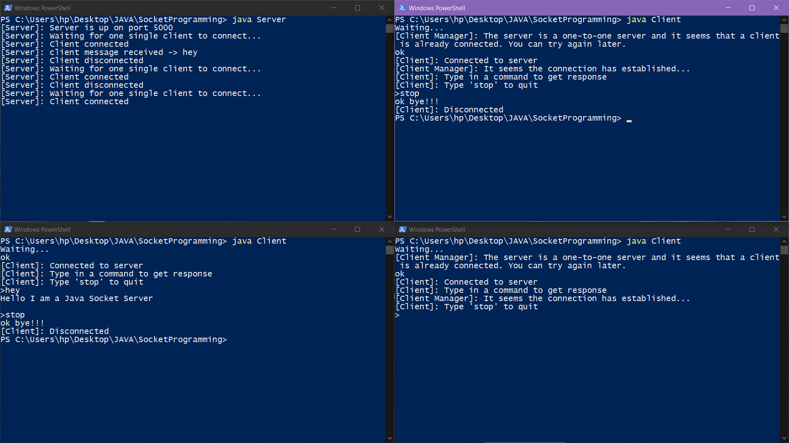

# interactive-socket-single-user
Its a basic Java web socket interactive application that serves single client only. While a client is already connected, other requesting clients would be waiting. Once the connected client disconnects, if there is a client waiting will get automatically connected to the server.

### Where can you get from here?
Well, this is the pretty much **basics** of *Socket Programming in Java*. Handling a single client request without using any thread pool is a pretty simple task compared to maintaining a thread pool of client sockets and servicing all of them. Also for notifying a waiting client, I have used threads so it would be a nice example for anyone starting Socket Programming in Java.

- Here, I have started the server by running ``` java Server ``` in the top left terminal. Then I have started the clients by ``` java Client ``` in the three other terminals. The client that was started first connects to the server and the other two goes waiting.


- After ten seconds of waiting, there is a log in the client terminals saying that the server must be busy.


- I have setup some pre-defined replies of some specific messages from clients to make it a fun.


- The stop message disconnects a client from the server and if client is in the queue then it gets connected. The client in the top right terminal was started after the bottom left one so it gets connected as soon as it disconnects.


- And when the top right client disconnects, the next in line, the bottom right one gets connected. Proper logs can be seen in the server terminal.



It can be useful for reference about how we can check for client connection, disconnection, message etc in a socket enviornment. Happy Learning!
